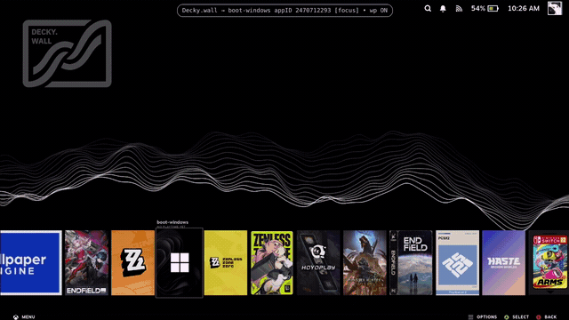

  <picture>
    <source media="(prefers-color-scheme: dark)" srcset="./Decky.wall_logo_ondark.png">
    
  </picture>

<h1 align="center">Decky.wall</h1>

  Run your own <b>Wallpaper Engine</b> wallpapers behind the Steam <b>Game Mode</b> Home screen. 
  A frontend-only <a href="https://github.com/SteamDeckHomebrew/decky-loader">Decky Loader</a> plugin.

  
  
  

---

## Demo

## What it is

Every "live wallpaper on Steam Deck" answer out there is **desktop mode**. Decky.wall puts a live **Wallpaper Engine** wallpaper behind the **Game Mode** Home screen — the real gamepad-UI background you see behind your game capsules, not the KDE desktop. You pick a wallpaper **you already own**, it bakes into the plugin, and it plays behind your games.

**Video wallpapers work reliably; web wallpapers are experimental** (many work, some don't yet). **It ships no wallpaper files** — it only bakes wallpapers from *your own* Workshop folder, on your own device. Open source (MIT).

> **Heads up:** built and tested on a **ROG Xbox Ally X (Bazzite)** — the same Game Mode stack (gamescope + gamepad UI + Decky) as a Steam Deck. I do **not** own a Steam Deck, so I can't verify real Deck hardware — testers very welcome (see [Testing](#testing-help-wanted)).

### How this differs from the KDE Wallpaper Engine plugin

If you've looked into live wallpapers on Linux, you've probably seen [`catsout/wallpaper-engine-kde-plugin`](https://github.com/catsout/wallpaper-engine-kde-plugin). It's a genuinely good project and worth using — but it solves a **different** problem, and the two aren't interchangeable:

- **It's for the KDE _desktop_.** It renders wallpapers on your Plasma desktop, not in Steam Game Mode. If what you want is a live background behind your **game capsules** on the handheld Home screen, that's this plugin, not that one.
- **It's a deeper system integration.** It hooks into the KDE compositor, which is powerful but means a broken wallpaper can affect your desktop session — some users report needing to recover it manually. That's the trade-off of desktop-compositor integration, not a knock on the project.
- **Decky.wall is deliberately shallow and disposable.** It's **frontend-only** — it draws into Steam's own UI layer and touches nothing at the system, driver, or compositor level. There's an **Enabled** toggle in the Quick Access Menu, and turning it off removes the wallpaper instantly. Worst case is a wallpaper that doesn't render; it can't take down your session.

Short version: **use the KDE plugin for your desktop, use this for Game Mode.** They can happily coexist.

## ⚠️ Before you start — please read

- **This only works in Steam _Game Mode_ on Bazzite or SteamOS** (a Steam Deck, or a handheld like the ROG Ally running **Bazzite**). Decky plugins run on the Linux / Game-Mode side, so **it does _not_ run on Windows.** If you dual-boot, do everything below on the **Bazzite** side.
- You need **[Decky Loader](https://github.com/SteamDeckHomebrew/decky-loader)** installed. This is a plugin *for* Decky.
- You need **Wallpaper Engine** installed (from Steam) with the wallpapers you own already downloaded.
- The desktop tool needs a **Chromium browser — Chrome, Edge, Brave, or Vivaldi. Firefox will _not_ work** (no File System Access API).
- **Use only wallpapers you own.** This plugin ships no wallpaper files — it just bakes your own.

## Install & first wallpaper (step by step)

> 📄 Latest version: **v3.0.6** — fixes game background art bleeding through the wallpaper (custom/second hero layers) and loads the wallpaper faster after a reload. See the [changelog](./CHANGELOG.md).

### 1 · One-time setup
1. Install **Decky Loader** if you don't have it ([install guide](https://github.com/SteamDeckHomebrew/decky-loader#installation)).
2. Turn on **Developer mode** in Decky: in **Game Mode**, press the **⋯ Quick Access** button → the **plug icon (Decky)** → **⚙ Settings** → **General** → toggle **Developer mode ON**. *(This unlocks "Install from ZIP".)*
3. Install **Wallpaper Engine** from Steam and let it finish downloading the wallpapers you subscribed to.

### 2 · Download the two files
From the **[latest release](../../releases/latest)**, download:
- **`Live-Wallpaper-vX.Y.Z.zip`** — the plugin.
- **`video-wallpaper-selector.html`** — the desktop tool you bake wallpapers with.

Save both somewhere easy to find (Desktop or Downloads).

### 3 · Install the plugin (in Game Mode)
1. Press **⋯ Quick Access** → **Decky (plug icon)** → **⚙ Settings** → **Developer** tab → **Install Plugin from ZIP File**.
2. Pick `Live-Wallpaper-vX.Y.Z.zip`. **"Live Wallpaper"** should now show up in your Decky plugin list.

> ⚠️ Install from the **ZIP** — don't just copy the folder into `~/homebrew/plugins/`. A plain copy often won't load.

### 4 · Bake your first wallpaper (in Desktop mode)
1. Switch to **Desktop mode** (**Steam button → Power → Switch to Desktop**).
2. Open **`video-wallpaper-selector.html`** in **Chrome / Edge / Brave** (not Firefox).
3. The first time, it asks for **two folders** — click each and grant access:
   - **Wallpaper Engine Workshop folder** — usually `~/.local/share/Steam/steamapps/workshop/content/431960` *(read)*.
   - **Your plugin folder** — `~/homebrew/plugins/Live Wallpaper` *(read/write)*.

   It remembers both, so you only do this once.
4. Pick a wallpaper → click **Use this**. Big videos show a **%** while they bake.

### 5 · See it
1. Switch back to **Game Mode** — returning reloads the plugin, and your wallpaper plays behind the Home screen.
2. Nothing showing? Open **⋯ → Decky → Live Wallpaper → Reload wallpaper**.

**That's it.** To change your wallpaper later, go back to Desktop mode and repeat **step 4**.

## Everyday use

- **Change your wallpaper:** go to Desktop mode, open the selector, pick a new one → **Use this**, then return to Game Mode. (Same as install step 4.)
- **Tweak the look without re-baking:** open the **Live Wallpaper** plugin in the Quick Access Menu — Fit, Dim, Brightness, Zoom, Position X/Y, and **Reset position** for video.
- **Turn it off / on:** the **Enabled** toggle in the same menu. (Turning it off instantly removes the wallpaper — handy if anything ever looks off.)

### Per-game wallpapers (v3)

Want a different wallpaper behind each game?

1. In the gallery, click **＋ Library** on the wallpapers you want to use (video or web). They copy into the plugin and show up in a **Per-game library** list.
2. Back in **Gaming Mode**, hover a game → open **Live Wallpaper** in the Quick Access Menu → use the **"Wallpaper for this game"** dropdown to pick **Default**, one of your library wallpapers, or **Off** (show the game's own art).
3. Scroll Home — the background swaps to each game's assigned wallpaper. Everything else stays on your Default.

Library wallpapers are stored as files inside the plugin folder (`dist/wp/`) and served locally, so adding one doesn't re-bake your big Default wallpaper.
**Assignments getting stuck?** Open **Live Wallpaper** in the Quick Access Menu and tap **Reset per-game assignments** to clear them all and start clean. *(New in v3.0.3 — re-bake to get the button.)*

## Good to know

- **The Wallpaper Engine app's own capsule won't show a wallpaper.** Wallpaper Engine is an *app*, not a game, so its Home tile doesn't have the standard background layer the plugin mounts wallpapers onto — so it stays on its own art no matter what you assign. This only affects that one tile; every actual game works normally.
