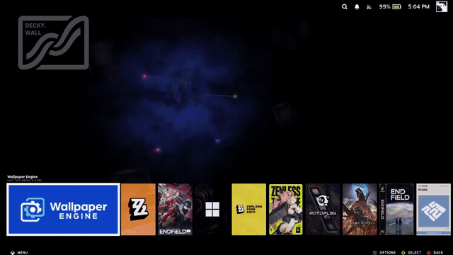
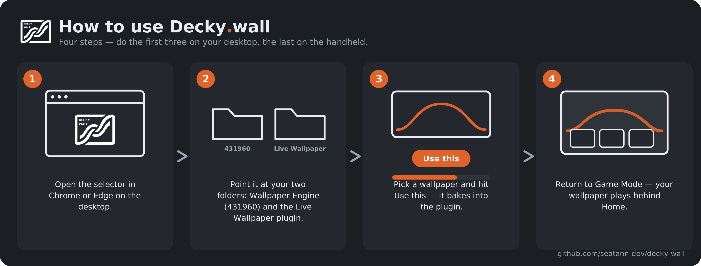

  <picture>
    <source media="(prefers-color-scheme: dark)" srcset="./Decky.wall_logo_ondark.png">
    
  </picture>

<h1 align="center">Decky.wall</h1>

  Run your own <b>Wallpaper Engine</b> wallpapers behind the Steam <b>Game Mode</b> Home screen. 
  A frontend-only <a href="https://github.com/SteamDeckHomebrew/decky-loader">Decky Loader</a> plugin.

  
  
  

---

## Demo

## What it is

Every "live wallpaper on Steam Deck" answer out there is **desktop mode**. Decky.wall puts a live **Wallpaper Engine** wallpaper behind the **Game Mode** Home screen — the real gamepad-UI background you see behind your game capsules, not the KDE desktop. You pick a wallpaper **you already own**, it bakes into the plugin, and it plays behind your games.

**Video wallpapers work reliably; web wallpapers are experimental** (many work, some don't yet). **It ships no wallpaper files** — it only bakes wallpapers from *your own* Workshop folder, on your own device. Open source (MIT).

> **Heads up:** built and tested on a **ROG Xbox Ally X (Bazzite)** — the same Game Mode stack (gamescope + gamepad UI + Decky) as a Steam Deck. I do **not** own a Steam Deck, so I can't verify real Deck hardware — testers very welcome (see [Testing](#testing-help-wanted)).

## ⚠️ Before you start — please read

- **This only works in Steam _Game Mode_ on Bazzite or SteamOS** (a Steam Deck, or a handheld like the ROG Ally running **Bazzite**). Decky plugins run on the Linux / Game-Mode side, so **it does _not_ run on Windows.** If you dual-boot, do everything below on the **Bazzite** side.
- You need **[Decky Loader](https://github.com/SteamDeckHomebrew/decky-loader)** installed. This is a plugin *for* Decky.
- You need **Wallpaper Engine** installed (from Steam) with the wallpapers you own already downloaded.
- The desktop tool needs a **Chromium browser — Chrome, Edge, Brave, or Vivaldi. Firefox will _not_ work** (no File System Access API).
- **Use only wallpapers you own.** This plugin ships no wallpaper files — it just bakes your own.

## Install & first wallpaper (step by step)

> 📄 Latest version: **v3.0.2** — wallpapers are now completely silent. See the [changelog](./CHANGELOG.md).

### 1 · One-time setup
1. Install **Decky Loader** if you don't have it ([install guide](https://github.com/SteamDeckHomebrew/decky-loader#installation)).
2. Turn on **Developer mode** in Decky: in **Game Mode**, press the **⋯ Quick Access** button → the **plug icon (Decky)** → **⚙ Settings** → **General** → toggle **Developer mode ON**. *(This unlocks "Install from ZIP".)*
3. Install **Wallpaper Engine** from Steam and let it finish downloading the wallpapers you subscribed to.

### 2 · Download the two files
From the **[latest release](../../releases/latest)**, download:
- **`Live-Wallpaper-vX.Y.Z.zip`** — the plugin.
- **`live-wallpaper-selector.html`** — the desktop tool you bake wallpapers with.

Save both somewhere easy to find (Desktop or Downloads).

### 3 · Install the plugin (in Game Mode)
1. Press **⋯ Quick Access** → **Decky (plug icon)** → **⚙ Settings** → **Developer** tab → **Install Plugin from ZIP File**.
2. Pick `Live-Wallpaper-vX.Y.Z.zip`. **"Live Wallpaper"** should now show up in your Decky plugin list.

> ⚠️ Install from the **ZIP** — don't just copy the folder into `~/homebrew/plugins/`. A plain copy often won't load.

### 4 · Bake your first wallpaper (in Desktop mode)
1. Switch to **Desktop mode** (**Steam button → Power → Switch to Desktop**).
2. Open **`live-wallpaper-selector.html`** in **Chrome / Edge / Brave** (not Firefox).
3. The first time, it asks for **two folders** — click each and grant access:
   - **Wallpaper Engine Workshop folder** — usually `~/.local/share/Steam/steamapps/workshop/content/431960` *(read)*.
   - **Your plugin folder** — `~/homebrew/plugins/Live Wallpaper` *(read/write)*.

   It remembers both, so you only do this once.
4. Pick a wallpaper → click **Use this**. Big videos show a **%** while they bake.

### 5 · See it
1. Switch back to **Game Mode** — returning reloads the plugin, and your wallpaper plays behind the Home screen.
2. Nothing showing? Open **⋯ → Decky → Live Wallpaper → Reload wallpaper**.

**That's it.** To change your wallpaper later, go back to Desktop mode and repeat **step 4**.

## Everyday use

- **Change your wallpaper:** go to Desktop mode, open the selector, pick a new one → **Use this**, then return to Game Mode. (Same as install step 4.)
- **Tweak the look without re-baking:** open the **Live Wallpaper** plugin in the Quick Access Menu — Fit, Dim, Brightness, Zoom, Position X/Y, and **Reset position** for video.
- **Turn it off / on:** the **Enabled** toggle in the same menu. (Turning it off instantly removes the wallpaper — handy if anything ever looks off.)

### Per-game wallpapers (v3)

Want a different wallpaper behind each game?

1. In the gallery, click **＋ Library** on the wallpapers you want to use (video or web). They copy into the plugin and show up in a **Per-game library** list.
2. Back in **Gaming Mode**, hover a game → open **Live Wallpaper** in the Quick Access Menu → use the **"Wallpaper for this game"** dropdown to pick **Default**, one of your library wallpapers, or **Off** (show the game's own art).
3. Scroll Home — the background swaps to each game's assigned wallpaper. Everything else stays on your Default.

Library wallpapers are stored as files inside the plugin, so adding one **doesn't** re-bake your big default.

> 💡 **Want the see-through look from the demo?** Steam's Home panels are opaque by default. To let the wallpaper show through the UI like in the clip, also install **[CSS Loader](https://github.com/suchmememanyskill/SDH-CssLoader)** (a Decky plugin).

## Features

- 🎮 **Per-game wallpapers (v3)** — build a library of your own wallpapers and assign a different one to each game; the background swaps as you scroll Home. Video and web both work.
- 🎬 **Video wallpapers** — played full-screen behind Home. Works reliably for most videos.
- 🌐 **Interactive web wallpapers (experimental)** — wrapped in a self-contained frame with a small shim so their runtime assets and properties load. **Many work, but not all — support is hit-or-miss right now.** (NIKKE's web wallpaper works.)
- 🧩 **Frontend-only** — no Python backend; everything lives in `dist/index.js`. Survives copy-only installs where the backend never runs.
- 🪫 **Battery-aware** — FPS-capped, and **pauses when a game is running**.
- 🎛️ **In-game controls** (Quick Access Menu) — Enable, Reload wallpaper, and for video: Fit, Dim, Brightness, Zoom, Position X/Y, and Reset position.
- 📦 **Streaming bake** — big video wallpapers install without crashing the browser; a 289 MB wallpaper installs and plays on my Ally X.

> ⚠️ **Scene** (`.pkg`) wallpapers are **not** supported — they're a proprietary format. Video and web only.

## Good to know (and a few warnings)

- **It can't harm your system.** A Decky plugin is frontend-only — it runs inside the Steam UI and can't touch your files, audio drivers, or the OS. If anything ever looks wrong, just **toggle it off in the Decky Quick Access Menu** — you never need to reinstall your system.
- **Reinstalling the plugin ZIP resets it.** The zip is a *blank* plugin, so reinstalling it clears your baked wallpaper and your per-game library (both live inside the plugin file). Just re-bake / re-add them. Updating only the **selector** doesn't touch the plugin.
- **Web wallpapers are hit-or-miss.** Video is the reliable path. Some web wallpapers render black or only partly — if one doesn't work, try another, or use it as a per-game pick rather than your default. **Scene (`.pkg`) wallpapers don't work at all.**
- **Big videos can be slow — or fail — on lower-RAM devices.** A 289 MB video works on my Ally X (24 GB RAM); a Steam Deck has less, so smaller/compressed videos are safer there.
- **Wallpapers are completely silent** by design (as of v3.0.2) — no wallpaper will ever play sound.
- **Battery:** it's FPS-capped and pauses while a game is running, but a live wallpaper still draws more power than a static background.
- **This is a hobby project by a beginner.** It works well on my hardware, but use it at your own discretion — and please [open an issue](../../issues) if something breaks. 🙏

## How it works (short version)

Decky plugins run in Steam's shared JS context, which is **not** the visible Home window. Decky.wall enumerates the Steam documents, finds the real Home window and its full-screen background layer, and mounts an opaque video/iframe over it — then animates off *that* window's own `requestAnimationFrame`. Steam's UI re-renders and strips injected DOM, so the mount re-asserts itself (interval + MutationObserver) to stay put while you scroll between games.

The wallpaper is embedded directly into `dist/index.js` (base64 for video, self-contained HTML for web). The desktop **